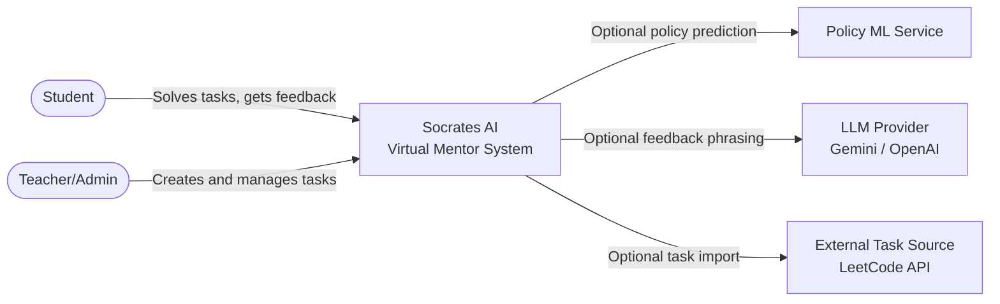
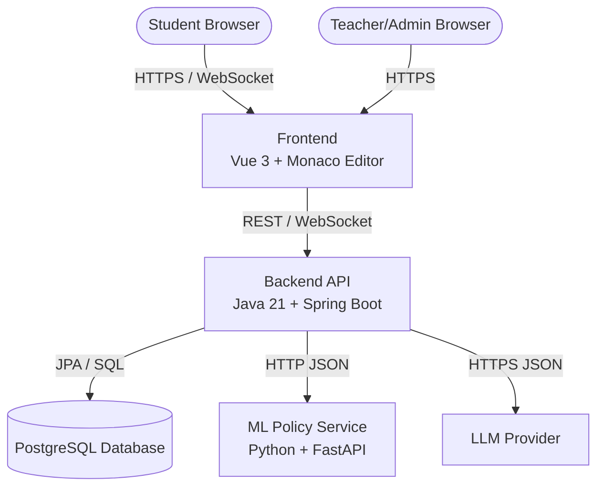
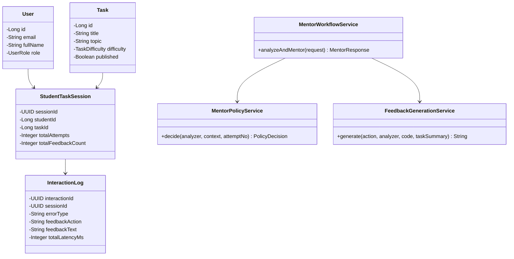
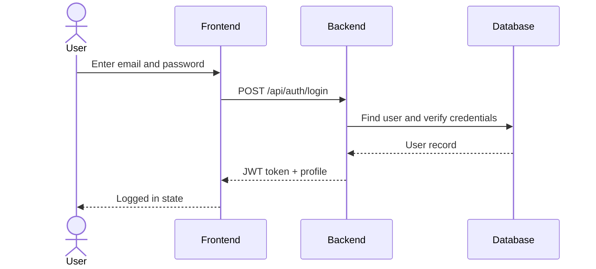
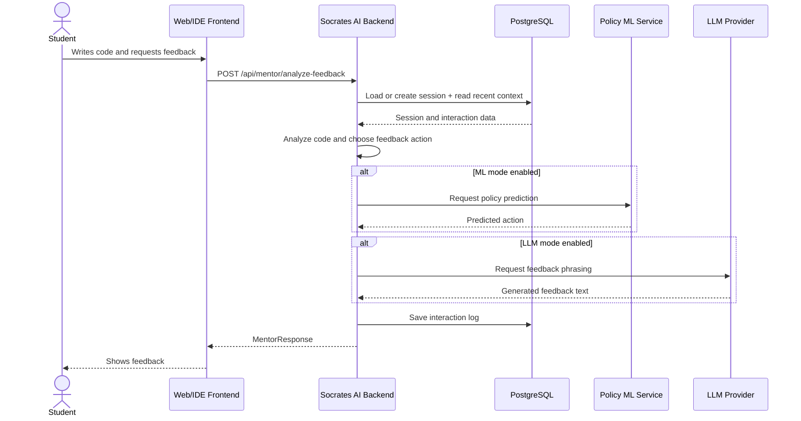
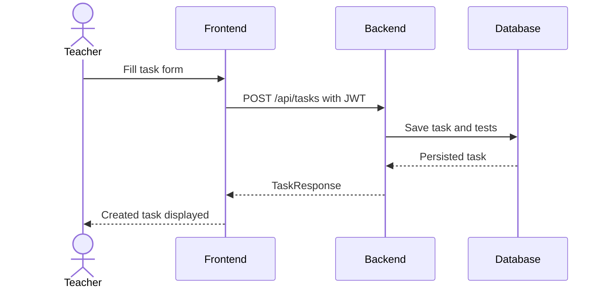
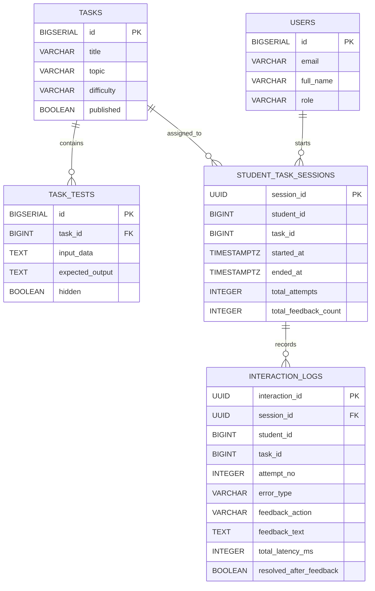

# Assignment 3: System Design & Architecture Documentation

**Course:** Software Development Case Study  
**Project:** Socrates AI  
**Student:** Koshikov Alimzhan

## 1. Introduction

Socrates AI is a virtual mentor for introductory programming. Its role is not to behave like a generic chatbot, but to give short and structured support while a student is solving a coding task. The system reads the submitted code, detects useful learning signals, chooses an appropriate pedagogical action, and returns feedback in real time.

The current implementation includes a Vue-based web frontend, a Spring Boot backend, a PostgreSQL database, and an optional ML policy service written in Python. The architecture is intentionally practical: the core mentoring path stays inside one backend application, while experimental AI features remain optional.

This document presents the architecture using the required methods: measurable non-functional requirements, C4 diagrams, one architecture decision record, component descriptions, UML diagrams, and a database ER diagram.

## 2. Task 1: Non-Functional Requirements & Trade-offs

### 2.1 NFR targets

| Quality attribute | Target | Measurement method | Justification |
|---|---:|---|---|
| Latency | P95 mentor response `< 1.2 s` in template mode | Response timing in `interaction_logs` and API tests | Students need feedback while still focused on the current code attempt. |
| Availability | `99.0%` during study/demo periods | Health checks and deployment uptime monitoring | The system is a prototype, but it should still be stable during supervised use. |
| Throughput | At least `30` concurrent students | Concurrent REST/WebSocket request simulation | This is enough for a small class or lab session. |
| Consistency | Strong consistency for users, tasks, sessions, and logs | Transactional tests and relational constraints | A mentor response must stay connected to the correct session and interaction record. |
| Security | `100%` write endpoints protected by JWT | Security tests with valid and invalid credentials | Students must not access teacher-only operations. |
| Data durability | RPO `< 24h`, RTO `< 2h` | Backup and restore checks | Interaction history is important for evaluation and future model improvement. |
| Maintainability | Core backend line coverage `>= 80%` | JaCoCo core report and CI | The system is still evolving, so safe refactoring matters. |
| ML fallback reliability | Rule-based fallback works in `100%` fallback-enabled failure cases | Unit tests around policy selection | The project must remain usable even when the ML service is unavailable. |

### 2.2 Main trade-off

The main trade-off is **feedback richness vs. reliability and speed**.

A fully LLM-centered mentor might sound more natural, but it would be slower, less predictable, and harder to control pedagogically. Socrates AI therefore prioritizes a stable tutoring flow: deterministic analysis, explicit policy actions, and optional LLM phrasing only when configured.

| Trade-off axis | Optimized for | Sacrificed |
|---|---|---|
| Latency vs throughput | Fast response for active learning | Very high public-scale load |
| Consistency vs availability | Reliable sessions and logs | Operating without a healthy database |
| Cost vs performance | Low-cost rule/template baseline | Constant premium LLM usage |
| Richness vs control | Short and safe pedagogical guidance | Open-ended chatbot style answers |

## 3. Task 2: C4 Architecture Diagrams

### 3.1 C4 Level 1: System Context

### 3.2 C4 Level 2: Container Diagram

This version keeps only the essential containers. The frontend handles interaction, the backend owns the mentoring workflow, the database stores durable data, and the ML/LLM services are optional external integrations.

## 4. Task 3: Architecture Decision Record

### ADR-001: Keep the core system as a modular backend and use ML as an optional external service

**Status:** Accepted  
**Date:** 2026-04-22

#### Context

Socrates AI needs authentication, task management, code analysis, pedagogical policy selection, feedback generation, and interaction logging. It also includes an experimental ML policy model. If every part were split into separate services too early, the project would become harder to develop, deploy, and test.

At the same time, the ML model naturally belongs to a Python stack because it is trained with pandas and scikit-learn. That makes it reasonable to keep the ML predictor outside the main Java backend.

#### Decision

The project uses a **modular Spring Boot backend** for the core tutoring workflow and a **separate optional Python ML service** for policy prediction.

#### Rationale

This decision keeps the most important flow simple: one backend receives the request, runs analysis, selects the action, generates feedback, and stores the interaction. That supports the system's main NFRs: fast response, reliable logging, and maintainability.

The ML service stays external because it is experimental and has a different technology stack. If it fails, the backend can safely return to a rule-based policy.

#### Alternatives rejected

| Alternative | Why rejected |
|---|---|
| Full microservice architecture | Too complex for the current project size and academic prototype scope. |
| Fully LLM-driven mentor | Harder to control, harder to test, slower, and weaker in traceability. |
| Embedded ML inside Java backend | Makes ML experimentation less flexible and mixes Java and Python concerns. |

#### Consequences

Positive consequences:

- easier local development;
- simpler testing;
- reliable fallback behavior;
- clearer traceability from request to stored interaction.

Negative consequences:

- backend may grow if module boundaries are ignored;
- ML contract must be maintained carefully;
- some scaling flexibility is postponed.

## 5. Task 4: Detailed Component Design

To keep the document readable, the design is described through the five most important components rather than every internal service class.

### 5.1 Frontend

| Field | Description |
|---|---|
| Purpose | Provide the student and teacher interface. |
| Responsibilities | Show tasks, provide code editor, send code to backend, display mentor feedback, manage login state. |
| Inputs | User actions and code text. |
| Outputs | UI state, task view, feedback panel, error messages. |
| Dependencies | Backend API through REST and WebSocket. |
| NFR sensitivity | Latency and usability. |

### 5.2 Backend API

| Field | Description |
|---|---|
| Purpose | Main system boundary and orchestration layer. |
| Responsibilities | Handle authentication, task APIs, mentor requests, WebSocket messages, persistence, and external integrations. |
| Inputs | REST and WebSocket requests from the frontend. |
| Outputs | JSON responses, CSV export, and WebSocket feedback messages. |
| Dependencies | Database, ML service, LLM provider. |
| NFR sensitivity | Reliability and maintainability. |

### 5.3 Analyzer and Mentor Engine

| Field | Description |
|---|---|
| Purpose | Convert code into feedback. |
| Responsibilities | Analyze code, build student context, choose pedagogical action, generate feedback text. |
| Inputs | Code submission, student ID, task ID, attempt number. |
| Outputs | `MentorResponse` with action, feedback text, error type, suspicious region, and timing. |
| Dependencies | Session data, interaction history, optional ML and LLM integrations. |
| NFR sensitivity | Latency and correctness of tutoring behavior. |

### 5.4 Data Storage

| Field | Description |
|---|---|
| Purpose | Store durable application and research data. |
| Responsibilities | Persist users, tasks, tests, sessions, and interaction logs. |
| Inputs | JPA writes from backend services. |
| Outputs | Query results for tasks, user profile, session state, and exported datasets. |
| Dependencies | Flyway migrations and PostgreSQL runtime. |
| NFR sensitivity | Consistency and durability. |

### 5.5 External AI Integrations

| Field | Description |
|---|---|
| Purpose | Extend the system without becoming mandatory for baseline operation. |
| Responsibilities | Predict feedback action through ML and optionally improve feedback phrasing through an LLM. |
| Inputs | Policy feature vectors and feedback generation prompts. |
| Outputs | Predicted action labels or generated text. |
| Dependencies | External HTTP APIs and provider availability. |
| NFR sensitivity | Reliability and cost. |

## 6. Task 5: UML Diagrams

### 6.1 UML Class Diagram

This class diagram keeps only the most important domain and service classes.

### 6.2 Sequence Diagram: User Login

### 6.3 Sequence Diagram: Student Code Submission and Mentor Feedback

This version shows only the essential flow.

### 6.4 Sequence Diagram: Teacher Creates a Task

### 6.5 Entity-Relationship Diagram

The ER diagram is also simplified to the core data structures.

## 7. Why this design is suitable

This simplified architecture works well for Socrates AI for three reasons.

First, the system needs a reliable tutoring flow more than a highly distributed infrastructure. A student submits code, the backend processes it, and the result is stored. Keeping that path simple makes the project easier to defend academically.

Second, the design separates stable and experimental parts. The core backend is stable and testable. The ML model and LLM integrations are useful, but they remain optional. That is important because the educational workflow must still work when those services are unavailable.

Third, the database is not just storage for normal application data. It also stores interaction history, which is important for evaluation, dataset export, and future improvements to the mentor policy.

## 8. Risks and Mitigations

| Risk | Impact | Mitigation |
|---|---|---|
| ML service unavailable | Policy prediction may fail | Keep rule-based fallback in the backend. |
| LLM service slow or expensive | Feedback becomes delayed or costly | Use templates as baseline and enable LLM only when needed. |
| Session inconsistency | Student history may become fragmented | Keep session handling inside one backend service and store interaction logs consistently. |
| Data loss | Evaluation dataset becomes incomplete | Use PostgreSQL, backups, and structured logging. |
| Backend growth over time | Maintainability may decrease | Keep modules separated and continue using coverage/CI checks. |

## 9. Traceability to Current Codebase

| Part of the design | Current location |
|---|---|
| Analyzer | `src/main/java/com/masters/socratesai/analyzer` |
| Mentor workflow | `src/main/java/com/masters/socratesai/mentor/service` |
| Policy logic | `src/main/java/com/masters/socratesai/mentor/policy` |
| Feedback generation | `src/main/java/com/masters/socratesai/mentor/feedback` |
| Interaction logging | `src/main/java/com/masters/socratesai/interaction` |
| Sessions | `src/main/java/com/masters/socratesai/session` |
| Authentication and security | `src/main/java/com/masters/socratesai/auth` and `src/main/java/com/masters/socratesai/security` |
| Tasks | `src/main/java/com/masters/socratesai/task` |
| Database schema | `src/main/resources/db/migration` |
| ML policy service | `ml/policy_api.py` |

## 10. Conclusion

Socrates AI uses a focused architecture that matches its real purpose: giving structured and timely programming feedback to beginners. The design is intentionally simpler than a large production system. The backend owns the mentoring workflow, PostgreSQL stores durable data, and ML/LLM integrations stay optional.

This makes the project easier to understand, easier to test, and easier to justify as a case study. The architecture is not trying to solve every problem at once. Instead, it supports the current educational and research goals in a controlled way.

## 11. Methods Used

- C4 Model for system context and container views
- Architecture Decision Record for the main architectural choice
- UML for class and sequence diagrams
- Entity-Relationship modeling for the database view
- Non-Functional Requirements analysis for architecture justification
